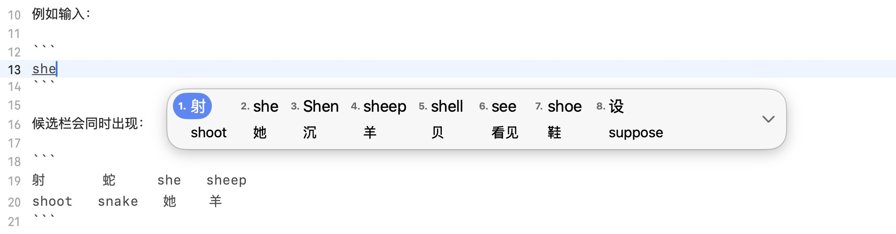
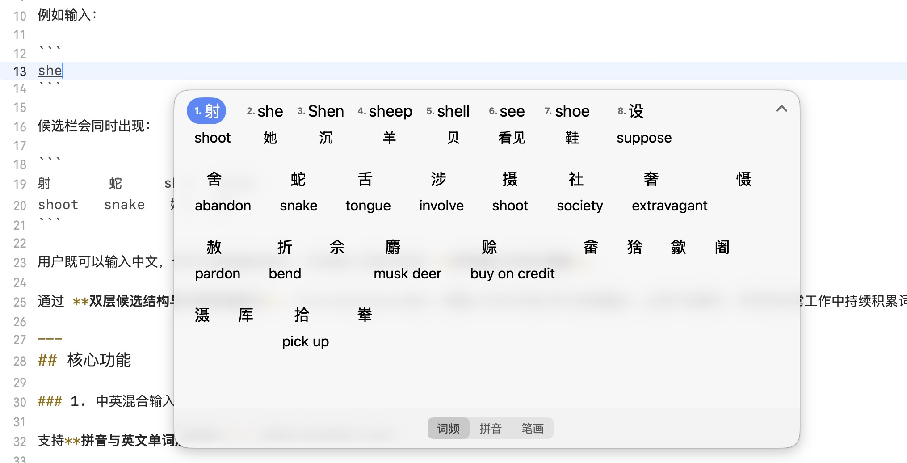
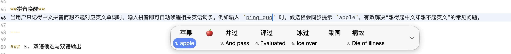
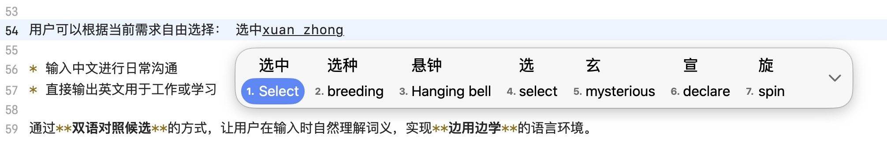
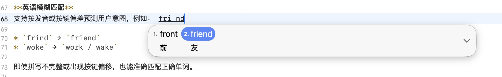
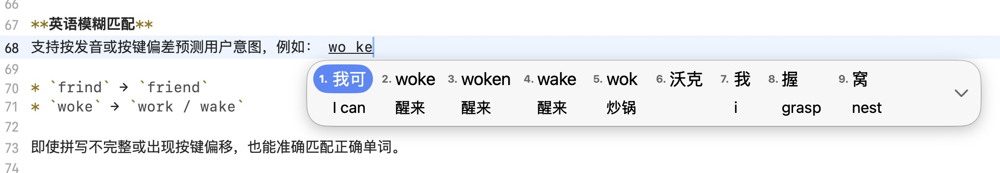
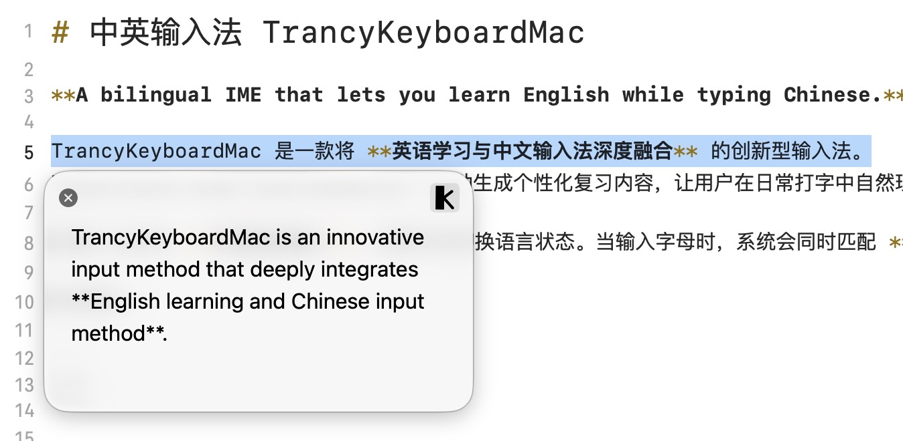
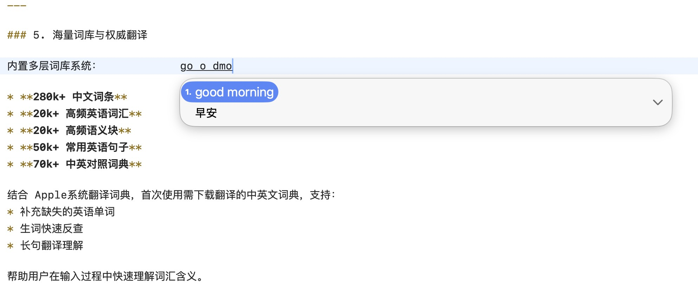
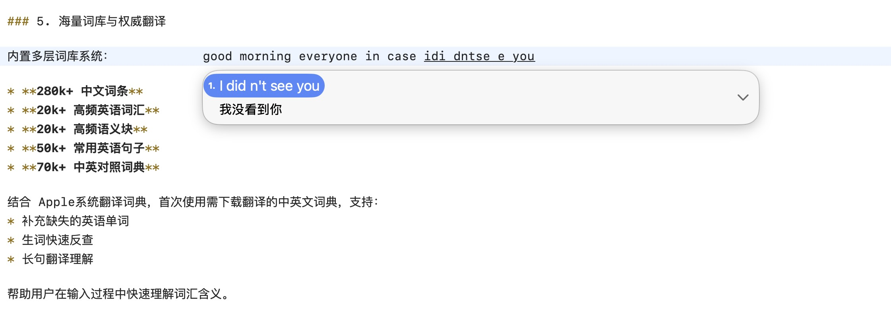
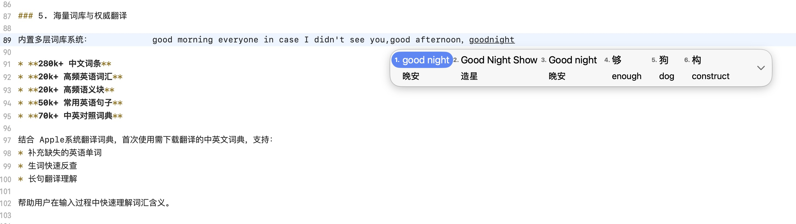

# 中英输入法 TrancyKeyboardMac

**A bilingual IME that lets you learn English while typing Chinese.**

TrancyKeyboardMac 是一款将 **英语学习与中文输入法深度融合** 的创新型输入法。
它通过记录用户在输入过程中选择的词汇，自动生成个性化复习内容，让用户在日常打字中自然理解和积累英语单词，实现真正的 **“输入即学习”**。

该输入法支持 **中英混合输入**，无需手动切换语言状态。当输入字母时，系统会同时匹配 **中文拼音候选** 与 **英语单词候选**。

例如输入：

```
she
```

候选栏会同时出现： 

```
射       蛇     she   sheep
shoot   snake   她    羊
```

用户既可以输入中文，也可以直接输出英文，并在输入过程中完成 **拼写确认与词义理解**。

通过 **双层候选结构与中英双语显示**，TrancyKeyboardMac 将输入行为与词汇学习自然融合，让用户在聊天、写作和日常工作中持续积累词汇，实现真正意义上的 **无感学习**。

---
## 核心功能

### 1. 中英混合输入

支持**拼音与英文单词混合输入**，无需手动切换输入状态。

输入字母时，系统会同时匹配**中文拼音候选**与**英语单词候选**。例如输入 `she`，候选栏会同时显示中文“射”“蛇”等拼音词，以及she / sheep 等英语单词，方便用户在输入过程中随时进行**拼写确认与词义反查**。

这种设计让中文输入与英语学习自然融合，实现真正的**输入与学习同步进行**。

---

### 2. 双语输入

**以英代中**
用户可以通过输入英文单词来检索对应的中文候选，例如输入 `apple` 可快速找到“苹果”。这一方式能够在日常输入中不断强化单词拼写，让单词记忆逐渐形成**肌肉记忆**。

**拼音唤醒**
当用户只记得中文拼音而想不起对应英文单词时，输入拼音即可自动唤醒相关英语词条。例如输入 `pingguo` 时，候选栏会同步提示 `apple`，有效解决“想得起中文却想不起英文”的常见问题。

**划词翻译**
在满足光标选中文字或剪贴板复制文字，点击任意输入区域，让输入法获得焦点，点击快捷键option + ~按键，调用苹果词典，自动识别目标语言，提供翻译句子。
---

### 3. 双语候选与双语输出

在字母输入过程中，候选栏会**同步展示中文与英文词汇**。

用户可以根据当前需求(快捷键tab)自由选择： 

* 输入中文进行日常沟通
* 直接输出英文用于工作或学习

通过**双语对照候选**的方式，让用户在输入时自然理解词义，实现**边用边学**的语言环境。

---

### 4. 模糊匹配与智能纠错

为了提升输入容错率，系统提供多层智能纠错机制：

**英语模糊匹配**
支持按发音或按键偏差预测用户意图，例如： woke

* `frind` → `friend`
* `woke` → `work / wake`

即使拼写不完整或出现按键偏移，也能准确匹配正确单词。

**拼音模糊匹配**
支持常见拼音模糊规则，例如：

* `zh / z`
* `ch / c`
* `an / ang`
* `en / eng`

并自动修正键盘误触。

---

### 5. 海量词库与权威翻译

内置多层词库系统：           

* **280k+ 中文词条**
* **20k+ 高频英语词汇**
* **20k+ 高频语义块**
* **50k+ 常用英语句子**   
* **70k+ 中英对照词典**

结合 Apple系统翻译词典，首次使用需下载翻译的中英文词典，支持：
* 补充缺失的英语单词
* 生词快速反查
* 长句翻译理解

帮助用户在输入过程中快速理解词汇含义。

---

### 6. 极致的输入体验

**滑行输入**
支持连续滑行打字，无需逐键点击。系统具备较高的路径容错能力，即使滑动轨迹略有偏差，也能准确识别用户意图。

**多输入方案支持**
* 26键全拼
* 小鹤双拼
**ios支持**
* 9键拼音
* 笔画输入

**高度个性化设置**

用户可以自由调整：
* 候选词显示层数，单层显示，翻译显示。
* 候选词上屏默认优先层级。
* 开启关闭查英语，英语前缀的自动推荐，模糊英语拼写功能。
* 开启关闭查中文，查表情，查符号，自动组词，选词加频率等功能
* 模糊拼音，拼音矫正，滑动输入
* 键盘高度，键盘配色，字体大小，按键音效，震动反馈

打造符合个人习惯的输入体验。

---

## 下载 PKG

1. 下载最新 Release

```
https://github.com/kindnessskl/TrancykeyboardMac/releases
```

2. 运行安装包

```
TrancyKeyboard.pkg
```
3. 重启电脑／logout 刷新系统缓存
                                                    
4. 打开系统设置

```
→ 键盘
→ 输入法 → 编辑 → 点击 +
→ 简体中文 → 中英输入法 → 添加

```

5. 启用输入法即可使用。

---
### macOS

本仓库对应 **macOS 版本**：

* 完全开源
* 免费使用

### iOS

iOS 版本为 **App Store 付费应用（￥10）**，包含： 

[https://apps.apple.com/cn/app/%E4%B8%AD%E8%8B%B1%E8%BE%93%E5%85%A5%E6%B3%95/id6756459946](https://apps.apple.com/cn/app/%E4%B8%AD%E8%8B%B1%E8%BE%93%E5%85%A5%E6%B3%95/id6756459946)                                                     
* 完整功能
* 生成选词历史，单词本学习功能。
---

## 开源协议与版本差异

本项目采用 **GPL-3.0** 开源协议。

### 1. 源码与数据库说明
本项目开放所有前端及逻辑层源代码，但出于保护生态及相关版权考虑，核心数据库不予开源（macOS 版本数据库采用加密处理）。

### 2. 版本说明
- **macOS 版本：** 本仓库对应的版本，完全开源并提供免费使用。
- **iOS 版本：** 为付费软件（售价 10 元），包含完整的内置功能与词库支持。

## 致谢

TrancyKeyboard 的开发参考了以下开源项目与数据集：

* **Rime-ice (雾凇拼音)**
  [https://github.com/iDvel/rime-ice](https://github.com/iDvel/rime-ice)
* **WordFrequency / COCA**
  [https://www.wordfrequency.info](https://www.wordfrequency.info)
  [https://www.english-corpora.org/coca/](https://www.english-corpora.org/coca/)
* **TypeDuck**
  [https://github.com/TypeDuck-HK/TypeDuck-Mac](https://github.com/TypeDuck-HK/TypeDuck-Mac)
* **Tatoeba**
  [https://tatoeba.org](https://tatoeba.org)
* **hallelujahIM**
 [https://github.com/dongyuwei/hallelujahIM](https://github.com/dongyuwei/hallelujahIM)
* **squirrel**
 [https://github.com/rime/squirrel](https://github.com/rime/squirrel)
* **talisman**
[https://github.com/Yomguithereal/talisman](https://github.com/Yomguithereal/talisman)
* **MDCDamerauLevenshtein**
[https://github.com/modocache/MDCDamerauLevenshtein](https://github.com/modocache/MDCDamerauLevenshtein)

感谢所有开源贡献者。

---
## 许可证

本项目基于 [GNU General Public License v3.0](LICENSE) 协议开源。

# 截图 Demo

```











```

